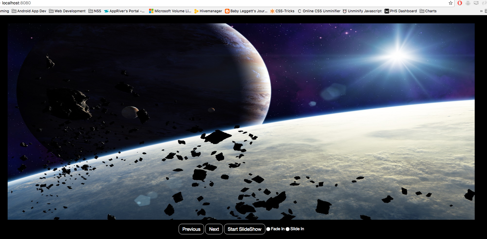
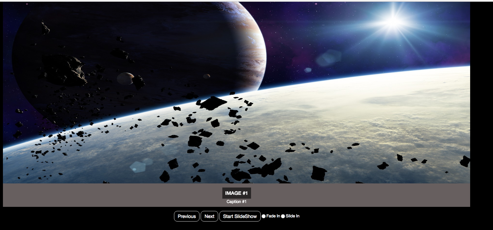
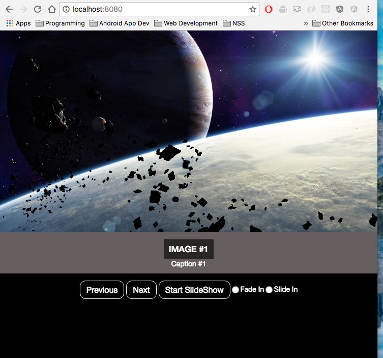
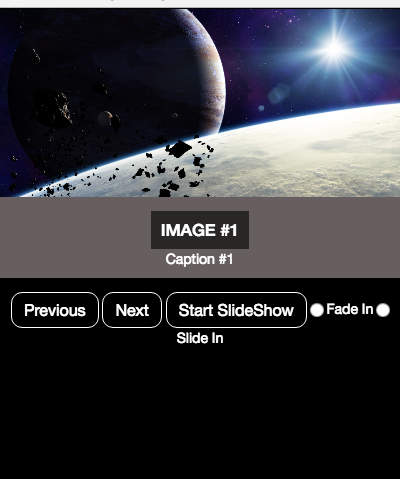

#Slideshow Using Jquery


## Description
In this project I made a slideshow using jquery, bootstrap, and some css magic to create a responsive slideshow with a caption.


## How to run
In your terminal run the following commands:
<br />
Navigate to the lib folder in your terminal and type:
```
npm install
```
This will install all of the dependencies for the project.
<br />
Next type the following:
```
cd ..
```
This will move you back to the root folder of the project.
<br />
Next type the following:
```
http-server -p 9999
```
Then navigate to [http://localhost:9999](http://localhost:9999) in your browser to view the output.

## Screenshot

###This is what the website looks like when it is loaded.

###This is an example of the caption feature.

###This is what the website looks like when is it loaded on an ipad or other device with a screen size between 720px - 991px.

###This is what the website looks like on an screen under 770px.

## Contributors
- [Justin Leggett](https://github.com/justinal64)